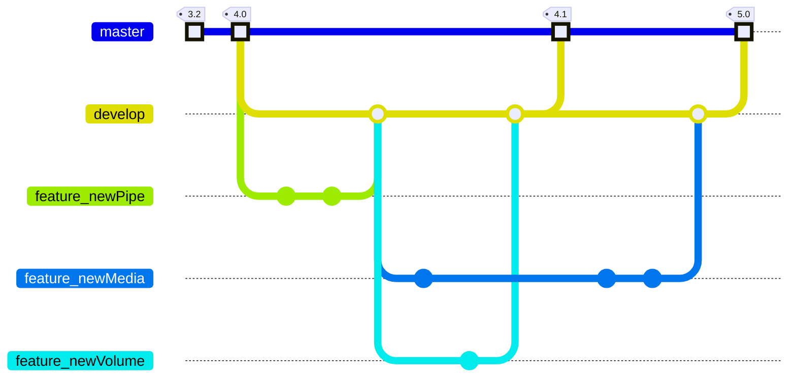
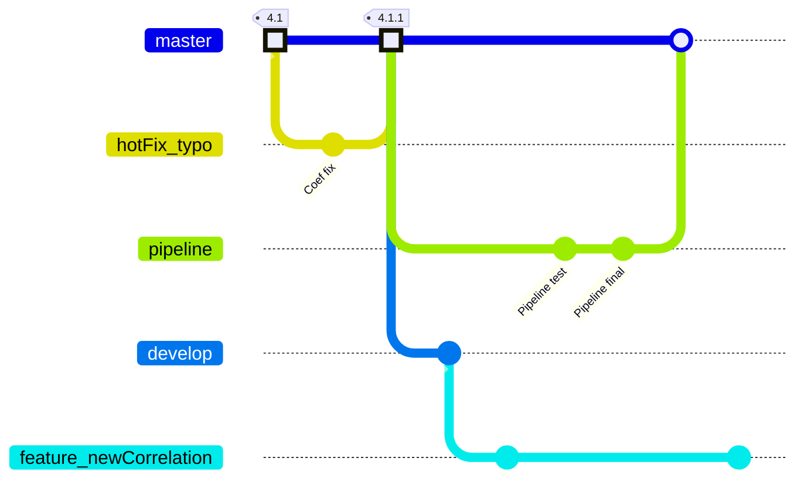
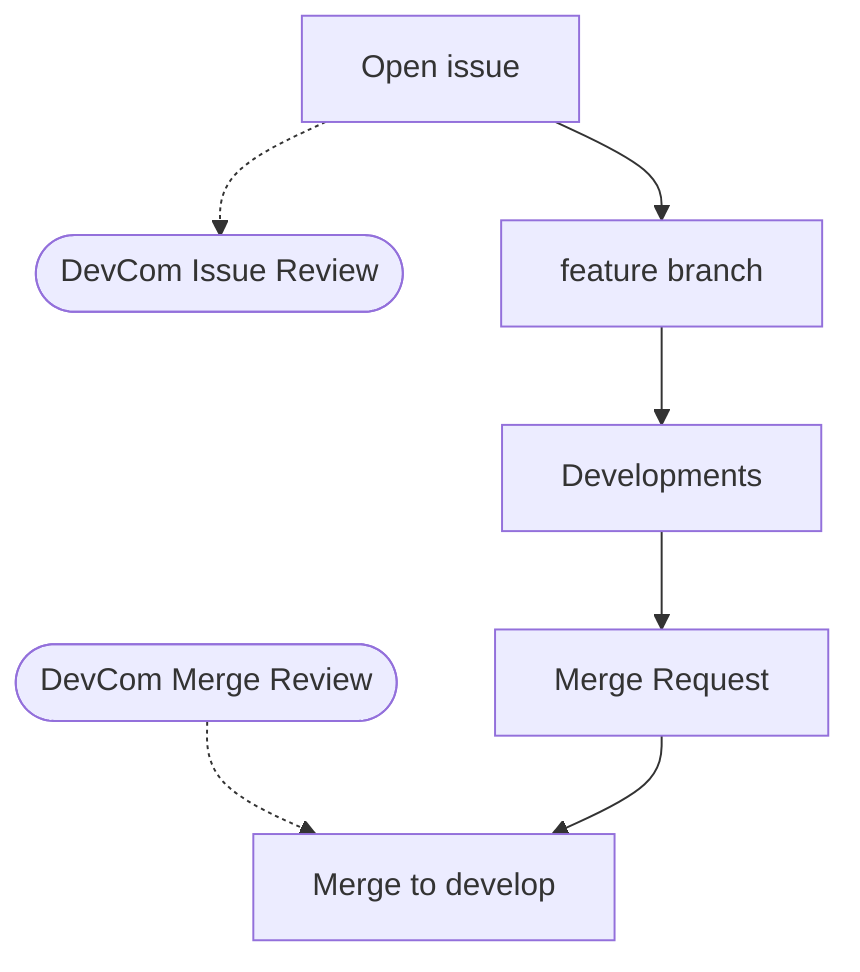

# Contribution and Development Guidelines

## First Things First: open an issue
To report a bug, request a new feature, propose a development or for any question, please open an [issue](https://gitlab.pam-retd.fr/thermosysproandco/ThermoSysPro/-/issues).

If you do not have an account on our GitLab platform you can:
- [Preferred option] [Mail us](mailto:contact-thermosyspro@edf.fr) to have your account created.
- [Not working yet] Use the *Service Desk* [mail] to open an issue by mail and be notified on updates.
- [Valid alternative] Open a issue on the [GitHub repository](https://github.com/ThermoSysPro/ThermoSysPro/issues).
- [Last resort] [Mail us](mailto:contact-thermosyspro@edf.fr) your issue so that we can open it on GitLab on your behalf. 

## Development Committee
Regular monthly meeting are run by the EDF R&D team responsible for the development of ThermoSysPro. 
This Committee has the following objectives:
- Review new issues, discuss the potential solution, assign them to a developer.
- Approve developments and merge requests.
- Discuss the development roadmap (library main orientations for the future).

Partners or issue reporter may be invited to participate to this meeting.

## Code Development

### Repository structure
The [`master`](https://gitlab.pam-retd.fr/thermosysproandco/ThermoSysPro/-/tree/master?ref_type=heads) branch contains only official releases. This is the *default* branch of the repository. A *tag* is associated to each release. No development is made directly in this branch (which is *protected*).

The [`develop`](https://gitlab.pam-retd.fr/thermosysproandco/ThermoSysPro/-/tree/develop?ref_type=heads) branch is the receptacle of all developments. This branch is also *protected*, meaning that developments can only be done through  `feature`/`fix`/... branches and associated *merge requests*; these branches originate from the `develop` branch and merge later into it. The `develop` branch merges into `master` to originate new official releases. 


#### Notable exceptions
Developments which are not related to the actual code (for example, files for CI/CD pipelines, readmes, minor documentation modification, graphics...) can be developed on `minor` branches that originate directly on `master` and are directly merged on it.

Such developments do not generate new official releases (no tag). This allows to make useful slight modifications (which do not affect the behavior of the models) quickly available.

Another exception concerns *quick* bug correction. `hotFix` branches should originates directly from `master` (instead of `develop`as common `feature` branches). Once merged back into `master`, they give place to a **patch version tag**. Then, `develop` has to be rebased on the new version of `master` with the following command:

```
git rebase master develop
```
This allows develop (and child-branches, once also rebased on `develop`) to inherit the bug correction. 




**Important Remarks**: 
- The `rebase` command restructures the git history: it makes the `develop` commits appear as if they were realized after the last state of `master` (the merge of `hotFix_typo` in the example) even if that is not the case. This clears the history and makes future merges less susceptible to conflicts. 
- It is **strongly recommended** to periodically rebase each development branch on the `develop` one, to reduce divergencies and conflicts later on; to be done by each developer. For example, looking at the 1st graph, `feature_newMedia` should be rebased on develop after the merge of `feature_newVolume`.

#### Branch naming
Development branches have to be named according to the following rule: `type/issue_description`, where:
- `type` is one among:
  - `feature`: development of new feature.
  - `fix`: bug correction.
  - `hotfix`: urgent bug correction, directly applied on `master`.
  - `misc`: development non related with the Modelica code; it may directly be applied on `master`.
- `issue` is the number of the issue the branch is devoted to.
- `description` is a short description of the development, more "solution oriented" rather than "issue oriented" (multiple solutions can be developed in different branches for the same issue). The description can be in `CamelCase` or with words separated by `-` (no whitespace). 

### Workflow
Here follows a synthetic view of the workflow for contribution:
1. Reporter: open an issue.

    &rarr; The issue will be reviewed by the Development Committee in the periodic meeting. Discussion on how to solve the issue can take place there and the issue will be commented accordingly. This first review should not delay the reporter from developing a solution by himself/herself following the next steps of the workflow. A developer from the Development Committee can also be designated to solve the issue.

    If developments are required (the issue is not a question, not *refused*...): 

1. Reporter/Developer: create a new `feature` branch from `develop`. *Hint: the branch can be created from the issue itself (to link the future developments to the issue)*. 

    It is recommended to directly create a Merge Request for that branch using the appropriate tag depending on the advances:
    - `WIP`: Work In Progress.
    - `reviewToMerge`: to be reviewed or ongoing review.
    - `readyToMerge`: waiting the final approval from the DevCom. 
1. Reporter/Developer: realize the necessary developments in as many *atomic* commits as needed. *Hint: cite the issue `#ID` in commit messages to link commits and issue*.
1. Reporter/Developer: create a merge request. 

    &rarr; The merge request will be reviewed by the Development Committee in their periodic meeting. 

1. If necessary, comments are added to the merge requests and some additional developments/iterations are requested.
1. DevCom action: The merge request is accepted and the `feature` branch is merged in the `develop` branch.




### <span style="color: #E0E0E0;"> Non-Regression Tests [Work in progress] </span>
<span style="color: #E0E0E0;">

Every commit pushed to the remote generates the following actions (*CI/CD pipeline*):

- Run non-regression tests:
    - Check, for a set of test models:
        - the translation,
        - the simulation.
    - Verification of results compared to reference calculation.
    - Report generation and its storage.
- Mail a notification to:
    - the committer, 
    - the *Dev Committee* members,
    - the person in charge of a test model in case of issues for that model. 
     
The *test models* are the models of the `Example` package of ThermoSysPro and an additional library of *private* models. Please [mail](mailto:contact-thermosyspro@edf.fr) us if you want to include some of your model in the test suite.
</span>